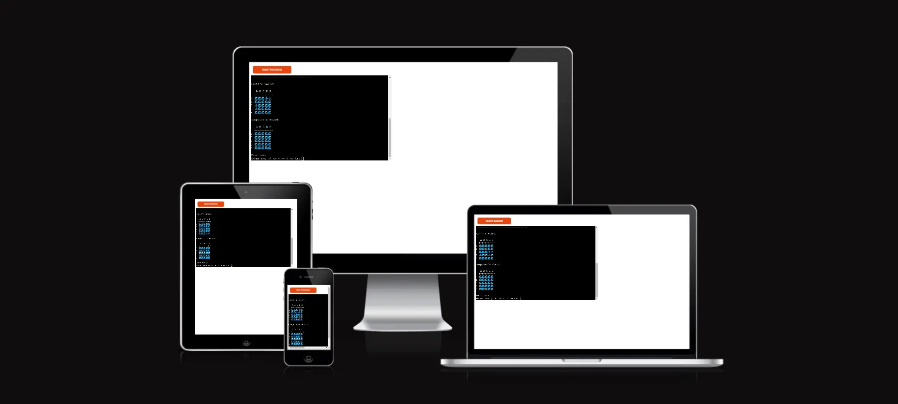

# Emoji Battleships
## my-third-project:
- [Live Site](https://emoji-battleships-5ae2f3e29783.herokuapp.com/)
- [Repository](https://github.com/EMPZsolt/my-third-project)

Emoji Battleships is a simple command-line game where players take turns trying to sink each other's ships on a 5x5 grid. The game is played against a computer opponent. The objective is to sink all of the computer's ships before the computer sinks all of your ships.

This is a game that you will want to play over and over again. Battleships is all about of strategy, memory and logic. It's a great game for enhancing your concentration, training your motor skills and improving of your strategic thinking. Everyone from children to adults can play. For the little ones it can sharpen their mind and for the grown ups, you can have pleasant, fun moments, while they can recall their childhood in the meantime.

## Contents
- [How to play](#how-to-play)
- [Design](#design)
     * [Imagery](#imagery)
- [Features](#features)
     * [Existing Features](#existing-features)
- [Technologies Used](#technologies-used)
     * [Languages Used](#languages-used)
     * [Libraries & Programs Used](#libraries--programs-used)
- [Deployment and Local Development](#deployment-and-local-development)  
     * [Deployment](#deployment)
     * [Local Deployment](#local-development)
          * [How to Fork](#how-to-fork)
          * [How to Clone](#how-to-clone)
- [Testing](#testing)
     * [Bugs](#bugs)
     * [W3C Validator](#w3c-validator)
     * [JSHint JavaScript Validator](#jshint-javascript-validator)
     * [Lighthouse](#lighthouse)
          * [Index page](#index-page)
- [Credits](#credits)
     * [Code Used](#code-used)
     * [Content](#content)
     * [Media](#media)
     * [Acknowledgments](#acknowledgments)

## How to play
1. Run the emoji_battleships.py script in your terminal or command prompt.
2. You will be greeted with the welcome message and game description.
3. Enter your name when prompted.
4. The game will display your board (with your ships) and the computer's board (the ships of the machine will be hidden).
5. During your turn, you will be asked to enter the row and column coordinates (either numeric or alphabetic).
6. The game will show the results of your shot and the computer's shot.
7. The game continues until one of the players wins.
8. After the game ends, the final message is displayed.

## Design
### Imagery
- I found the emojis on a public website. I have credited this in the credits section.
- The idea of the board structure I took it from a YouTube video. I have credited this in the credits section.

## Features
### Existing Features
- 

