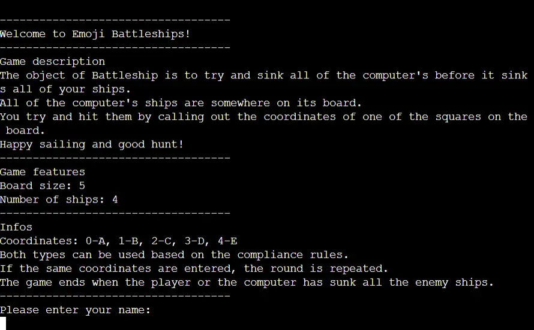
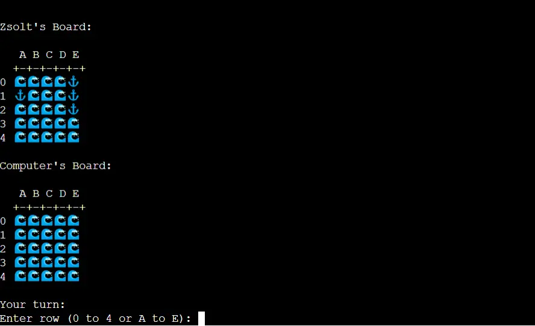
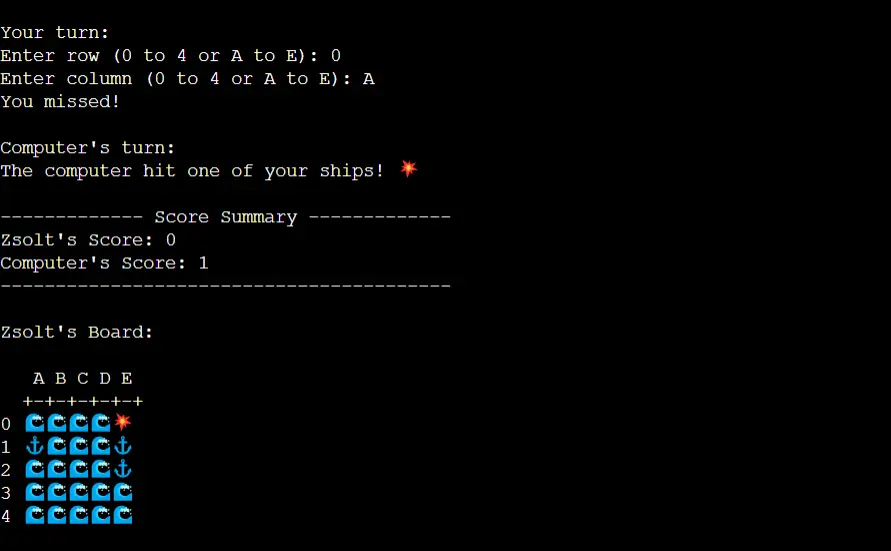
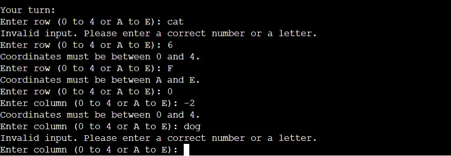
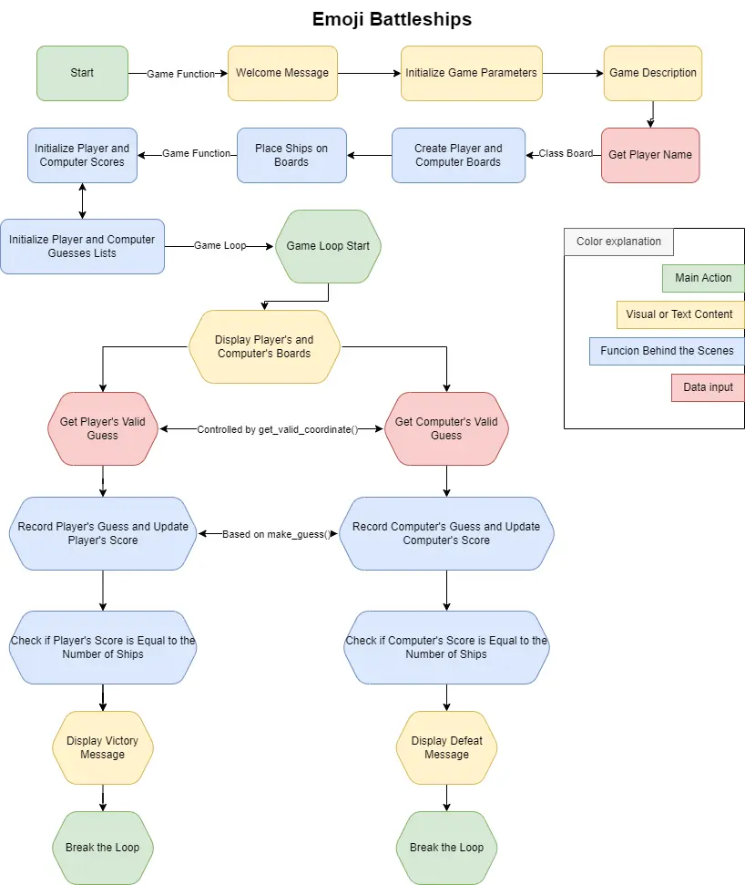
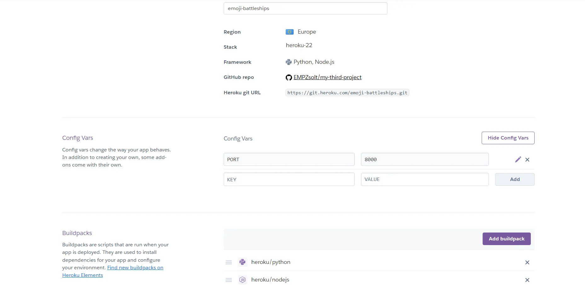
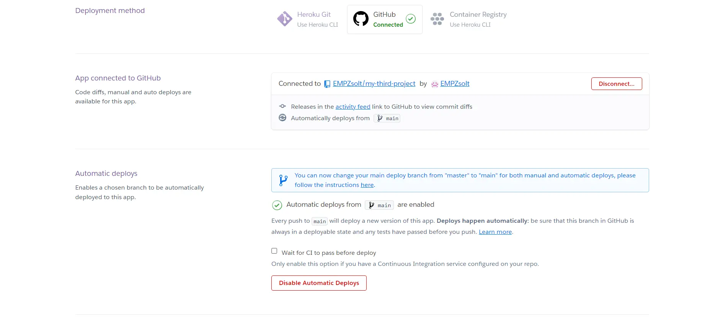

# Emoji Battleships
## my-third-project:
- [Live Site](https://emoji-battleships-5ae2f3e29783.herokuapp.com/)
- [Repository](https://github.com/EMPZsolt/my-third-project)

Emoji Battleships is a simple command-line game where players take turns trying to sink each other's ships on a 5x5 grid. The game is played against a computer opponent. The objective is to sink all of the computer's ships before the computer sinks all of your ships.

This is a game that you will want to play over and over again. Battleships is all about of strategy, memory and logic. It's a great game for enhancing your concentration, training your motor skills and improving of your strategic thinking. Everyone from children to adults can play. For the little ones it can sharpen their mind and for the grown ups, you can have pleasant, fun moments, while they can recall their childhood in the meantime.

## Contents
- [How to play](#how-to-play)
- [Design](#design)
     * [Imagery](#imagery)
- [Features](#features)
     * [Existing Features](#existing-features)
     * [Future Features](#future-features)
- [Flow chart](#flow-chart)
- [Technologies Used](#technologies-used)
     * [Languages Used](#languages-used)
     * [Libraries & Programs Used](#libraries--programs-used)
- [Deployment](#deployment)
- [Testing](#testing)
     * [Bugs](#bugs)
     * [W3C Validator](#w3c-validator)
- [Credits](#credits)
     * [Code Used](#code-used)
     * [Content](#content)
     * [Media](#media)
     * [Acknowledgments](#acknowledgments)

## How to play
1. Run the emoji_battleships.py script in your terminal or command prompt.
2. You will be greeted with the welcome message and game description.
3. Enter your name when prompted.
4. The game will display your board (with your ships) and the computer's board (the ships of the machine will be hidden).
5. During your turn, you will be asked to enter the row and column coordinates (either numeric or alphabetic).
6. The game will show the results of your shot and the computer's shot.
7. The game continues until one of the players wins.
8. After the game ends, the final message is displayed.

## Design
### Imagery
- I found the emojis on a public website. I have credited this in the credits section.
- The idea of the board structure I took it from a YouTube video. I have credited this in the credits section.

## Features
### Existing Features
- Intro text:
     - The game starts with a welcome message and a description (as well as the parameters and rules of the game).
     
     
- The playground:    
     - A two-player board is created with randomly placed ships.
     - The computer's ships are hidden from the player.
     - The game awaits for the coordinates.
     

- Coordinate input, results and scores summary:
     - Start to play against the computer.
     - Entering valid coordinates.
     - Get the result from our and the computer randomized guess.
     - Get a scores summary after each round.
     

- Input validation:
     - You can only choose within the grid.
     - Only that input valid which meets the compliance rules.
     - If you enter an already used coordinate, the round will repeat.
     

### Future Features
- Multiple player mode option.
- Adjustable board size.
- Different ship sizes and their manual placement.
- Option to exit the game at any time

## Flow chart
- I used Draw.io to create a flow chart of the game separating individual elements and processes of the program with colors and shapes. 

- 

## Technologies Used
### Languages Used
Python were used to create this game.
### Libraries & Programs Used
- Git - For version control.
- Github - To save and store the files for the website.
- Heroku - To represent the live program.
- Tiny PNG - To compress images.
- FreeConvert - To compress images in the webp format.
- Am I Responsive? - To show the website image on a range of devices.
- Paint - To cut the images to the right size.
- Draw.io - To create the flow chart

## Deployment
- The app was deployed to Heroku using the following steps:
     - Create new app:
     - 
     - Add buildpacks and config VARS:
     - 
     - Connect Heroku to GitHub
     - Authorise the connection
     - Connect to the correct repository
     - 
     
